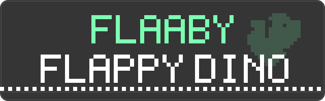
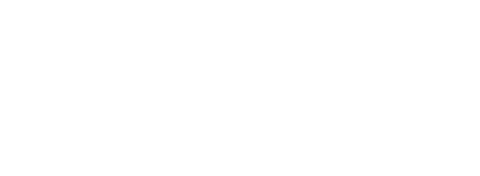
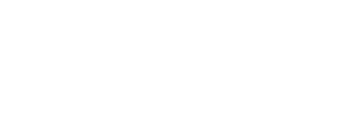
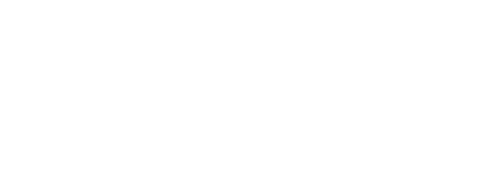

<p align="center">
  
</p>

> ### 👤 Student Profile
> * **Name:** Soumyadip Karforma
> * **City:** Asansol
> * **State:** West Bengal
> * **Country:** India

> ### 🎥 Project Video
> * **Presentation URL:** [Watch on YouTube](https://youtu.be/OL2s49dfkAQ)
> * **Direct Link:** `https://youtu.be/OL2s49dfkAQ`

# FLAABY (Flappy Dino)

A tiny, addictive flappy-style game in the dino's monochrome pixel look - white pixels on dark gray, a chunky pixel font, translucent clouds, and a scrolling dashed ground. It runs everywhere: as a Chrome extension (Alt+Shift+F), as a standalone webpage, and on your phone. No dependencies, no build step, no assets to download - one file of JavaScript, pure canvas.

Built as my [CS50x](https://cs50.harvard.edu/x/) final project.

[](https://html.spec.whatwg.org/)
[](https://developer.mozilla.org/en-US/docs/Web/JavaScript)
[](https://developer.mozilla.org/en-US/docs/Web/API/Canvas_API)
[](https://developer.chrome.com/docs/extensions/)
[](LICENSE)
[](https://cs50.harvard.edu/x/)

---

## Play Now

<p align="center">
  <a href="https://flaaby.skiono.me"></a>
  <a href="https://flaaby.soumyadipkarforma.workers.dev"></a>
</p>

No install, no signup. Open one of the links above on any device and start flapping.

---

## Screenshots







---

## What is FLAABY?

FLAABY is a faithful take on the classic flap-the-bird-through-pipes formula, dressed up as the dinosaur-run look: everything is drawn on a 600 x 220 pixel grid and scaled up with crisp pixel edges. Hold to float, release to fall, and thread the gaps while the world speeds up, shrinks, and gets meaner the longer you survive.

It was built as a single self-contained HTML page - open it, and it runs. That same page is also the Chrome extension's game screen.

## Features

- **No dependencies** - plain JavaScript + the Canvas API. One file, works offline, works from `file://`.
- **Hold-to-float controls** - tap to flap, hold to rise gently, release to fall. Simple to learn, tricky to master.
- **Adaptive difficulty** - the speed ramps up, settles into a comfortable cruise, and the pipe gaps keep shrinking until a run eventually ends.
- **Drifting pipes** - after 30 points, ~45% of pipes drift up and down while scrolling, and the drift gets faster as the game goes on.
- **Pterodactyls** - after 50 points, ~40% of obstacles are replaced by a flapping pterodactyl gliding at a bobbing height.
- **Pixel trail** - fading pixels stream off the bird's tail while you fly.
- **Speed dashes** - faint horizontal streaks fly past once you're moving fast.
- **Procedural sound** - Web Audio synth: a rising pitch the higher you climb, a crash buzz, a blinking marker on score-ups, and a flashing NEW BEST when you pass your record mid-run.
- **Persistence** - your best score is saved in `localStorage` and shown on the title screen.
- **Touch friendly** - tap and touch-and-hold work on phones; the canvas resizes to any screen without scrolling or pull-to-refresh.
- **Tiny** - the whole game is one JavaScript file, no images, no audio files.

## How to Play

| Input | Action |
| --- | --- |
| `Space` / `Up` / `W`, or click / tap | Flap - quick upward impulse |
| Hold `Space` (or hold click / touch) | Slow, gentle rise - the bird floats while held |
| `Esc` / `P` | Pause / resume |
| Release before the ceiling | The sky is a wall - touching it kills you |

The bird starts at the top of the sky, so let go right after starting or you'll fly straight into the ceiling. The game auto-pauses when the tab loses focus.

## Scoring

- **1 point per 100 px** of distance traveled - dino-style.
- The HUD in the top-right shows `HI xxx` (best) and the current score, even on the title screen.
- Game over shows `SCORE xxx  BEST xxx`.
- Your best is saved live in `localStorage` (`flappyDinoHi`) the moment you beat it.

## Difficulty & Obstacles

Difficulty `d = playTime/90 + score/45` grows forever, but the speed follows a curve: it launches at **140 px/s**, peaks around **300 px/s**, then eases back to a **~185 px/s** cruise. The challenge comes from the gaps instead:

- Pipe gaps start at 68 px and keep shrinking - no floor. Eventually a run always ends.
- Pipe spacing starts at 380 px and tightens down to a 190 px floor.
- Every gap and spacing jitters around the current difficulty, so no two runs look the same.
- Collisions are swept (continuous), so obstacles never tunnel through the bird.

Obstacles:

- **Pipes** - always, with a randomized gap. After 30 points, ~45% drift up and down while scrolling; the gap size stays the same, it just rides the pipe.
- **Pterodactyls** - after 50 points, ~40% of obstacles become a flapping pterodactyl at a bobbing height - fly over or under.

## Sound

All audio is synthesized with the Web Audio API - no audio files, works offline. While the bird climbs, a continuous tone rises in pitch with altitude. A buzz plays when you crash. A small marker blinks next to the score when it increases, and a blinking NEW BEST appears when you pass your record mid-run. Audio starts on your first input (browser autoplay policies).

---

## Install as a Chrome Extension

1. Go to `chrome://extensions`
2. Enable **Developer mode** (top-right toggle)
3. Click **Load unpacked**
4. Select this folder (`flaaby`)

Then click the toolbar icon or press **Alt+Shift+F** to open the game from anywhere. The extension is Manifest V3 with zero permissions and only reacts to your explicit input - it never runs in the background.

## Run It Locally

```bash
git clone https://github.com/soumyadipkarforma/flaaby.git
cd flaaby
```

That's it - open `index.html` in any browser. Or serve it with any static server:

```bash
# Python
python3 -m http.server 8000
# then open http://localhost:8000
```

## Play Anywhere

| Where | Link |
| --- | --- |
| Hosted | [flaaby.skiono.me](https://flaaby.skiono.me) |
| Hosted (Cloudflare Workers) | [flaaby.soumyadipkarforma.workers.dev](https://flaaby.soumyadipkarforma.workers.dev) |
| Chrome extension | Load unpacked from this repo |
| Mobile | Open either hosted link on any phone or tablet |

## Repository Layout

| Path | Role |
| --- | --- |
| `index.html` | Page shell: canvas + styles; works as demo and extension page |
| `game.js` | All game logic: physics, pipes, difficulty ramp, pixel font and sprites |
| `background.js` | Service worker that opens the game on toolbar icon click |
| `manifest.json` | MV3 manifest (Alt+Shift+F shortcut, zero permissions) |
| `icons/` | Pixel-bird icons |
| `screenshots/` | README screenshots |
| `assets/` | README buttons |

## FAQ

**Is there a score sound?** No beeps on score-ups - the game uses a blinking marker and a tone that rises with altitude instead.

**Can I change the difficulty?** Tweak the constants at the top of `game.js` - gravity (`220`), terminal fall (`75`), flap cap (`-60`), hold-rise (`-45`), and the gap/spacing curves.

**Does it work offline?** Yes. It runs from `file://` with zero network requests.

**Does it work on mobile?** Yes - tap to flap, hold to float, and the canvas fits any screen.

**Is my best score kept?** Yes, in `localStorage` under `flappyDinoHi`, per browser/device.

---

## Support & Sponsor

If FLAABY made you lose a few minutes (or hours) of productivity, consider fueling the next release:

[](https://github.com/sponsors/soumyadipkarforma)
[](https://www.patreon.com/SoumyadipKarforma)
[](https://www.buymeacoffee.com/soumyadipkarforma)

## Connect

[](https://github.com/soumyadipkarforma)
[](https://instagram.com/soumyadip_karforma)
[](https://x.com/soumyadip_k)
[](https://youtube.com/@soumyadip_karforma)
[](https://reddit.com/user/soumyadipkarforma)
[](https://discord.com/users/soumyadip_karforma)
[](mailto:soumyadipkarforma@gmail.com)

---

## License

Licensed under the [Apache License 2.0](LICENSE). You can use, modify, and distribute it freely for personal or commercial projects - just keep the attribution notice.

FLAABY is not affiliated with or endorsed by any company. It's an original game inspired by the classic flappy-bird and dino-run formulas.